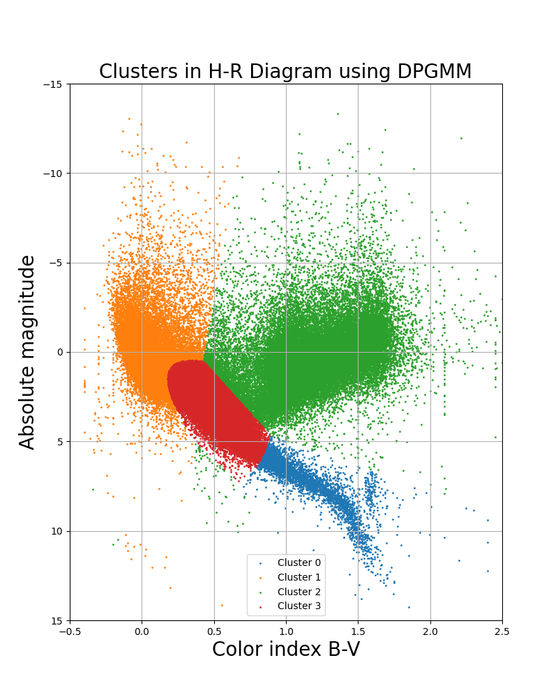
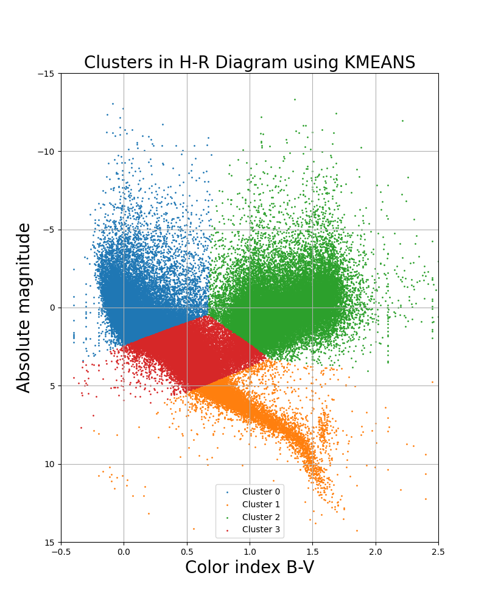

<h1>HR Diagram Clustering</h1>

This project demonstrates clustering of stars based on the Hertzsprung-Russell (HR) Diagram using data from the Hipparcos catalog.

<h2>Data Source</h2>

The data used in this project is sourced from the Hipparcos catalog, <a href="https://vizier.cds.unistra.fr/viz-bin/VizieR-3?-source=I/239/hip_main">VizieR</a>

<h2>Dependencies</h2>

This project relies on the following Python libraries:

<ul>
    <li><code>numpy</code></li>
    <li><code>pandas</code></li>
    <li><code>matplotlib</code></li>
    <li><code>scikit-learn</code></li>
</ul>

<h2>Project Workflow</h2>

<ol>
    <li>Data Cleaning:</li>
    <ul>
        <li>Read data from the file and clean the dataframe by handling missing values.</li>
        <li>Convert columns to appropriate data types.</li>
        <li>Calculate absolute magnitude and handle infinite values.</li>
    </ul>
    <li>Feature Selection:</li>
    <ul>
        <li>Select relevant features for clustering: <code>"B-V"</code> and <code>"M_V"</code>.</li>
        <li>Scale or normalize the data using <code>StandardScaler</code>.</li>
    </ul>
    <li>Clustering Algorithms:</li>
    <ul>
        <li>Apply Dirichlet Process Gaussian Mixture Model (DPGMM) for clustering.</li>
        <li>Apply KMeans clustering.</li>
    </ul>
    <li>Visualization:</li>
    <ul>
        <li>Plot clusters on the H-R Diagram for both DPGMM and KMeans.</li>
    </ul>
</ol>

<h2>Results</h2>

<table border="1">
    <tr>
        <th>Feature</th>
        <th>Count</th>
        <th>Mean</th>
        <th>Standard Deviation</th>
        <th>Minimum</th>
        <th>25th Percentile</th>
        <th>50th Percentile (Median)</th>
        <th>75th Percentile</th>
        <th>Maximum</th>
    </tr>
    <tr>
        <td>Vmag</td>
        <td>110726.000</td>
        <td>8.268266</td>
        <td>1.243306</td>
        <td>-1.440000</td>
        <td>7.590000</td>
        <td>8.380000</td>
        <td>9.050000</td>
        <td>13.110000</td>
    </tr>
    <tr>
        <td>Plx</td>
        <td>110726.000</td>
        <td>7.386535</td>
        <td>11.133374</td>
        <td>0.010000</td>
        <td>2.700000</td>
        <td>4.740000</td>
        <td>8.460000</td>
        <td>772.330000</td>
    </tr>
    <tr>
        <td>B-V</td>
        <td>110726.000</td>
        <td>0.697777</td>
        <td>0.483801</td>
        <td>-0.400000</td>
        <td>0.344000</td>
        <td>0.602000</td>
        <td>1.068000</td>
        <td>5.460000</td>
    </tr>
    <tr>
        <td>M_V</td>
        <td>110726.000</td>
        <td>1.601420</td>
        <td>2.329619</td>
        <td>-13.310000</td>
        <td>0.259416</td>
        <td>1.505791</td>
        <td>3.051987</td>
        <td>15.449015</td>
    </tr>
</table>

<h2>Usage</h2>

To run the project, ensure you have the required dependencies installed. Execute the Python script, and visualizations will be generated.

<h2>License</h2>
